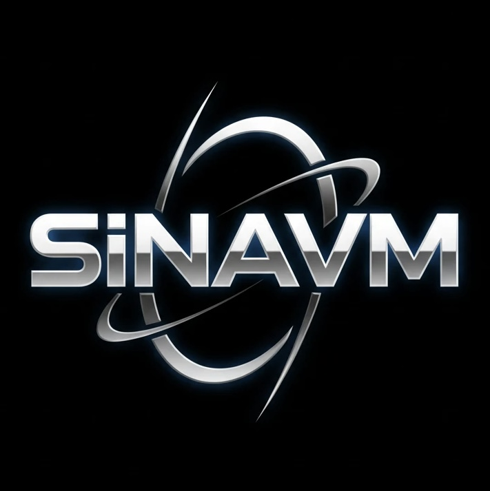

  

  <h1>سینا</h1>
  <h3>Sina · sinavm</h3>

  
<strong>سازنده ابزارهای متن‌باز برای دسترسی پایدار به اینترنت</strong>

  
Open-source tools for reliable connectivity · 1.7k+ stars

  

    
    
    
  

  

    
    
    
  

---

### درباره من

سینا هستم. روی ابزارهایی کار می‌کنم که کانفیگ‌ها، سابسکریپشن‌ها و کلاینت‌های مختلف را در یک جریان ساده جمع می‌کنند. تمرکز اصلی‌ام محصول‌هایی است که در شرایط محدودیت شبکه هم قابل استفاده بمانند.

- نگهداری پروژه‌های عمومی با بیش از **۱٬۷۰۰ ستاره** و حدود **۱٬۴۰۰ دنبال‌کننده**
- توسعه مبدل و جمع‌آور کانفیگ (`SVM`) به‌همراه صفحات آماده برای کلاینت‌های رایج
- انتشار منظم آپدیت از طریق گیتهاب و کانال تلگرام [t.me/sinavm](https://t.me/sinavm)

### About

I build public tooling around subscriptions, config conversion, and client-ready pages. Most of the work ships in Persian for people who need something that stays reachable when the network is restricted.

---

### پروژه‌های شاخص

| پروژه | توضیح | ستاره |
| :--- | :--- | :---: |
| [sinavm](https://github.com/sinavm/sinavm) | هاب عمومی و GitHub Pages | 838 |
| [SVM](https://github.com/sinavm/SVM) | جمع‌آوری و تبدیل کانفیگ به فرمت کلاینت‌ها · PHP | 431 |
| [melishekan](https://github.com/sinavm/melishekan) | فایل بک‌آپ آماده برای VPN Client Pro | 247 |
| [sing-box](https://github.com/sinavm/sing-box) | کانفیگ آماده سینگ‌باکس با بروزرسانی خودکار | 176 |
| [Hiddify](https://github.com/sinavm/Hiddify) | صفحه و منابع هیدیفای | 44 |

  
  
  

---

### استک

  
  
  
  
  
  
  
  

---

### مشارکت

اگر از پروژه‌ها استفاده می‌کنید، ستاره بزنید تا از آپدیت‌ها باخبر شوید.

  <a href="https://t.me/sinavm">تلگرام</a> ·
  <a href="https://sinavm.github.io/sinavm/">وب‌سایت</a> ·
  <a href="https://instagram.com/sinabigo">اینستاگرام</a>

Built in public · Maintained by sina (@sinavm)

